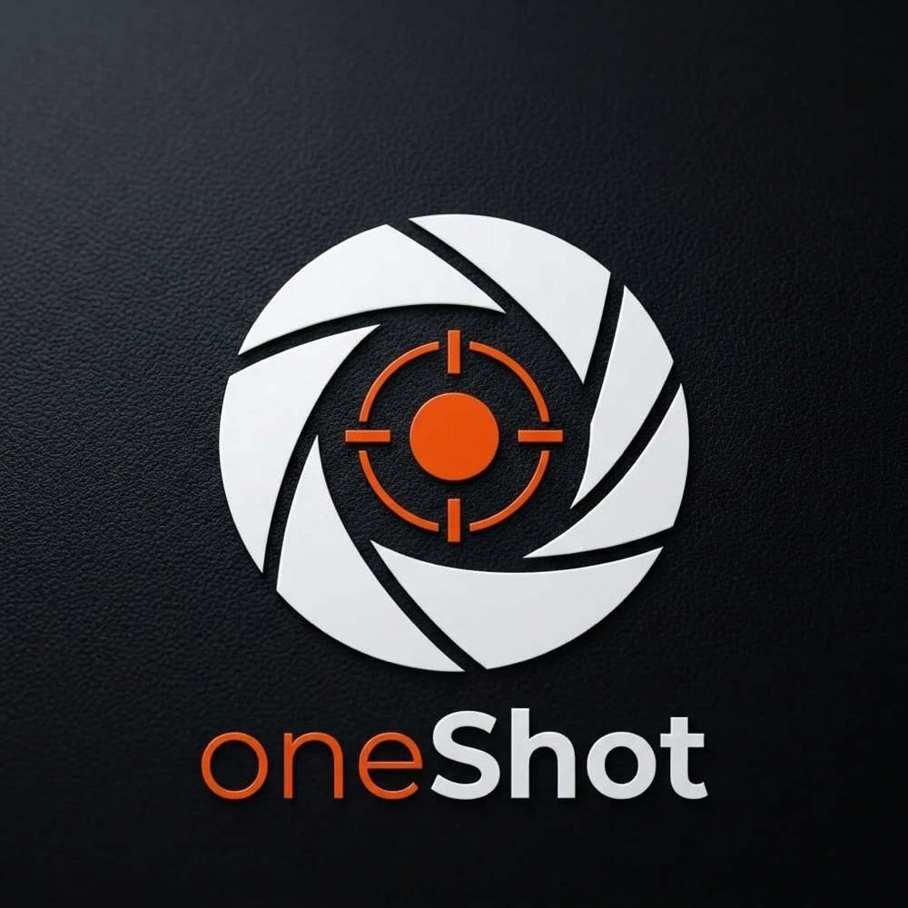

# OneShot AI — Autonomous Browser Agent & Automation Platform

An enterprise-grade autonomous browser agent and task automation suite built with Next.js 15, React 19, TypeScript, Tailwind CSS, Playwright, and Gemini AI.



## 🌟 Key Features

- **Autonomous Web Navigation**: Powered by Gemini vision models and Computer Use element grounding.
- **Interactive Browser Simulation**: Viewport rendering with live AI cursor, target coordinate tracking, and DOM inspector.
- **Executable Pipeline**: Step-by-step checklist tracking each browser action with latency and reasoning.
- **Playwright Script Generation**: Instantly export automation flows to clean TypeScript and Python Playwright scripts.
- **Cross-Origin Dev Access**: Configured in `next.config.ts` with `allowedDevOrigins: ["172.20.10.2", "localhost"]` for multi-device testing.
- **Bilingual Interface**: Seamless toggle between English and Arabic (RTL) styled for the OneShot brand.

---

## 🚀 Getting Started

### 1. Run Development Server
```bash
npm run dev
```
Open [http://localhost:3000](http://localhost:3000) or test on your local network at [http://172.20.10.2:3000](http://172.20.10.2:3000).

### 2. Build for Production
```bash
npm run build
npm run start
```

---

## 🛠 Project Structure

```
├── next.config.ts            # Next.js 15 config with allowedDevOrigins
├── eslint.config.mjs         # Flat ESLint configuration
├── public/brand/             # OneShot brand logos & assets
└── src/
    ├── app/                  # App Router pages & API routes
    ├── components/           # UI Components (Viewport, Pipeline, Console, Modals)
    ├── lib/                  # Playwright code generator & templates
    └── types/                # TypeScript interfaces
```

---
Developed for **OneShot** (1shotcam.com).
